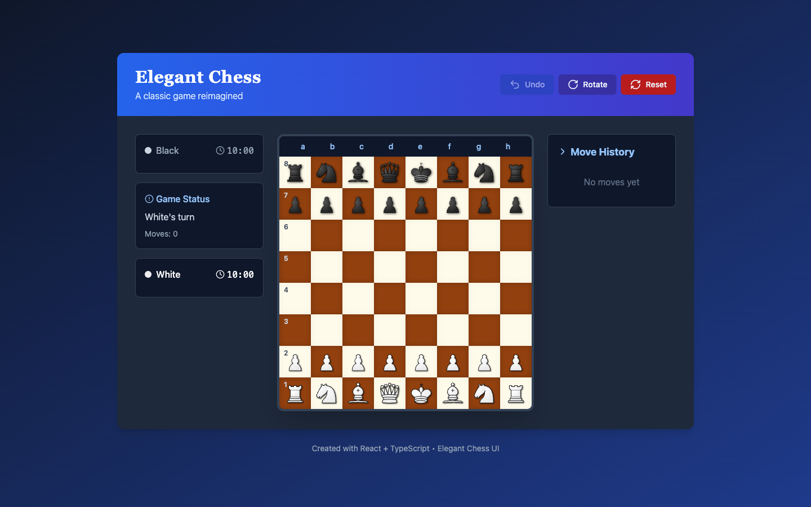

# Elegant Chess

<div align="center">

     

</div>

A classic chess game reimagined for the browser — built with Next.js, TypeScript, and Tailwind CSS. Play a full two-player game with move validation, clocks, and a refined board UI.

## Features

- **Full chess rules**: legal move generation, captures, check and checkmate detection
- **Two-player hotseat** play on a single board
- **Game clocks** for both sides (10:00 each)
- **Move history** with move counter
- **Undo** the last move, **rotate** the board, or **reset** the game
- **Board coordinates** (a–h, 1–8) and turn indicator
- **Status panel** showing whose turn it is and game state alerts
- **Crisp icon set** via lucide-react

## Tech Stack

| Layer | Technology |
|---|---|
| Framework | Next.js 14 (Pages Router) |
| Language | TypeScript |
| Styling | Tailwind CSS |
| Icons | lucide-react |

## 📸 Screenshots

### Game Board — Clocks & Move History



## Getting Started

### Prerequisites

- Node.js 18+
- npm

### Installation

```bash
git clone https://github.com/iabhishek18/elegant-chess.git
cd elegant-chess
npm install
```

### Development

```bash
npm run dev
```

Open [http://localhost:3000](http://localhost:3000) and make your first move.

### Production Build

```bash
npm run build
npm start
```

## Project Structure

```
├── pages/
│   ├── _app.tsx        # App wrapper, global styles
│   ├── _document.tsx   # HTML document shell
│   └── index.tsx       # Board state, move validation, clocks, UI
├── public/             # Static assets
├── styles/
│   └── globals.css     # Tailwind directives
├── next.config.mjs
├── tailwind.config.ts
└── tsconfig.json
```

## How It Works

The board is an 8×8 matrix of piece objects in React state. Selecting a piece computes its legal destination squares, which are highlighted on the board; completing a move flips the active clock and appends to the move list. Undo restores the previous board snapshot.

## License

MIT
